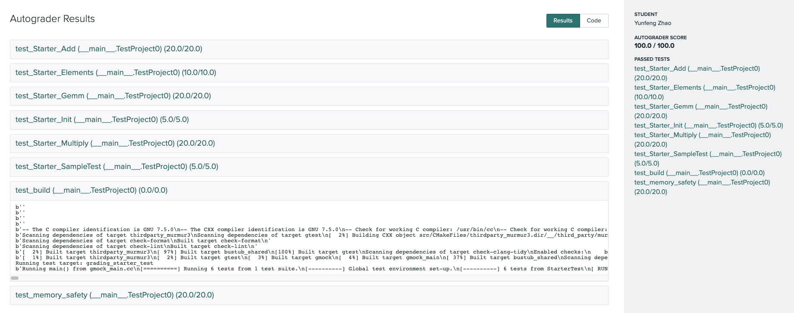
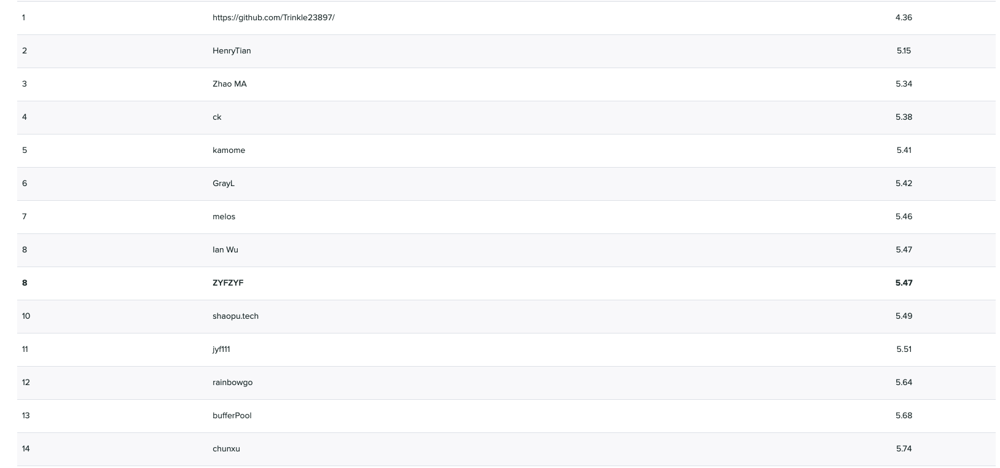
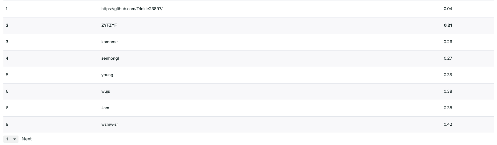
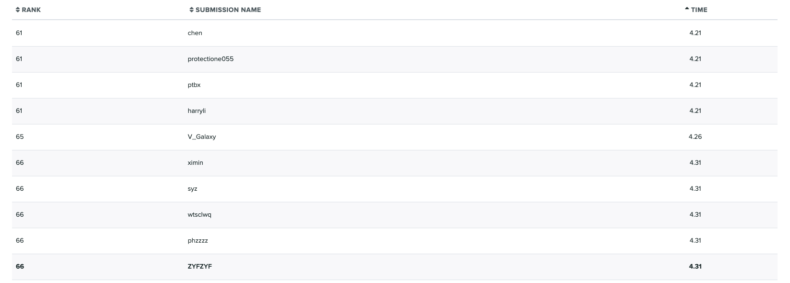
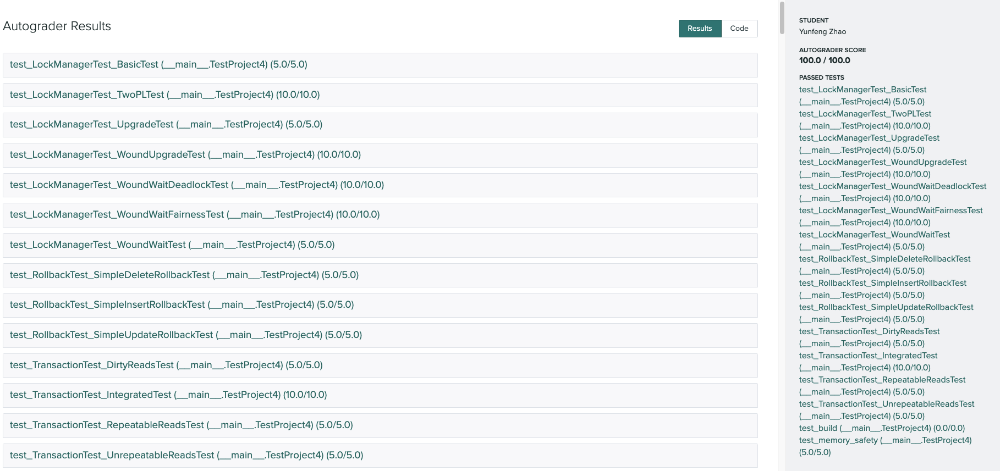

# CMU15-445-2021

https://15445.courses.cs.cmu.edu/fall2021/

## Status

- [x] PROJECT #0 - C++ PRIMER

  

- [x] PROJECT #1 - BUFFER POOL
    - [x] TASK #1 - LRU REPLACEMENT POLICY
    - [x] TASK #2 - BUFFER POOL MANAGER INSTANCE

  

- [x] PROJECT #2 - EXTENDIBLE HASH INDEX
    - [x] TASK #1 - PAGE LAYOUTS
    - [x] TASK #2 - HASH TABLE IMPLEMENTATION
    - [x] TASK #3 - CONCURRENCY CONTROL

  

- [x] PROJECT #3 - QUERY EXECUTION

  

- [x] PROJECT #4 - CONCURRENCY CONTROL
    - [x] Task #1 - Lock Manager
    - [x] Task #2 - Deadlock Prevention
    - [x] Task #3 - Concurrent Query Execution

  

